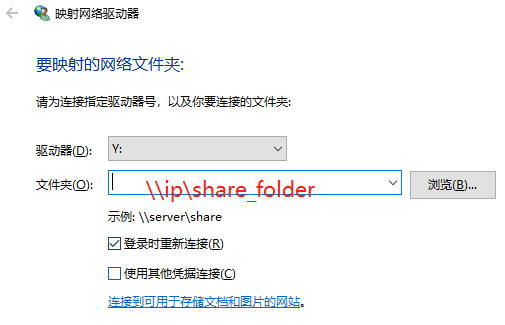

# [samba文件服务器](https://sites.google.com/site/devlibrary/linux/samba-wen-jian-fu-wu-qi-she-zhi-zui-jian-dan-pian-)

管理员：

1. 创建samba账号
```bash
sudo smbpasswd -a <username>
```
2. 配置samba conf，在文件`/etc/samba/smb.conf`底部添加如下内容，有几个用户就添加几个下面模板，将username换成具体的用户名
```bash
[username]
  path = /home/<username>
  available = yes
  browseable = yes
  public = no
  writable = yes
  valid users = <username>
  create mask = 0755
  directory mask = 0755
```
3. 重启samba
```bash
sudo /etc/init.d/smbd restart
```

管理员可设置免除认证的共享文件夹，步骤如下：
1. 创建共享samba账号
2. 配置samba conf如下：

```bash
[haslab]
  path = /home/haslab/share
  available = yes
  browseable = yes
  public = yes
  writable = yes
  create mask = 0777
  directory mask = 0777
  guest ok = yes
```
3. 设置共享文件夹可读可写权限，`sudo chmod -R 777 /home/haslab/share/`

用户：
1. 验证是否能登录samba文件服务器
- 在Windows上登录samba文件服务器：win+r，输入\\\\ip
- 在Mac上登录samba文件服务器：打开finder，然后command+k，输入samba://ip
2. [将文件服务器与磁盘驱动器映射](https://blog.csdn.net/hunanchenxingyu/article/details/9751639)，在Windows10，点击此电脑->映射网络驱动器。


